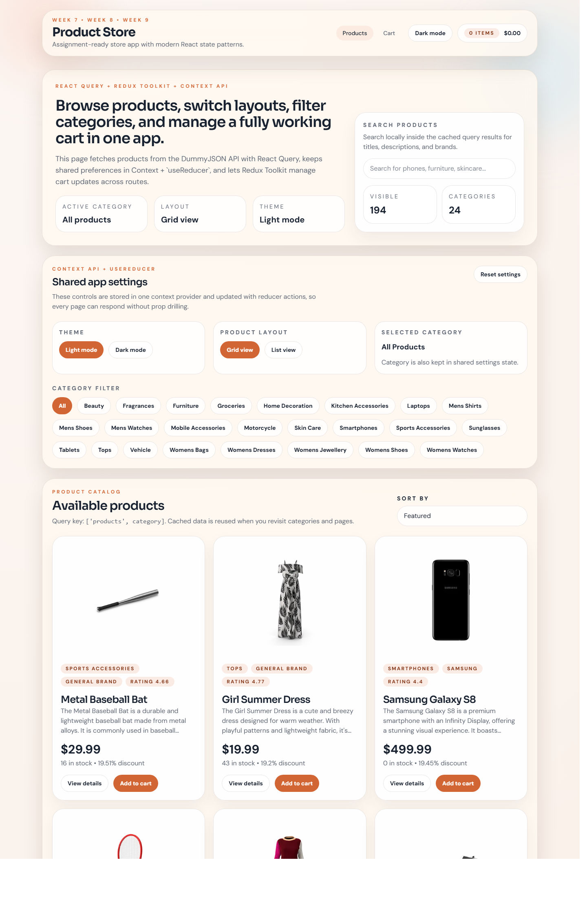
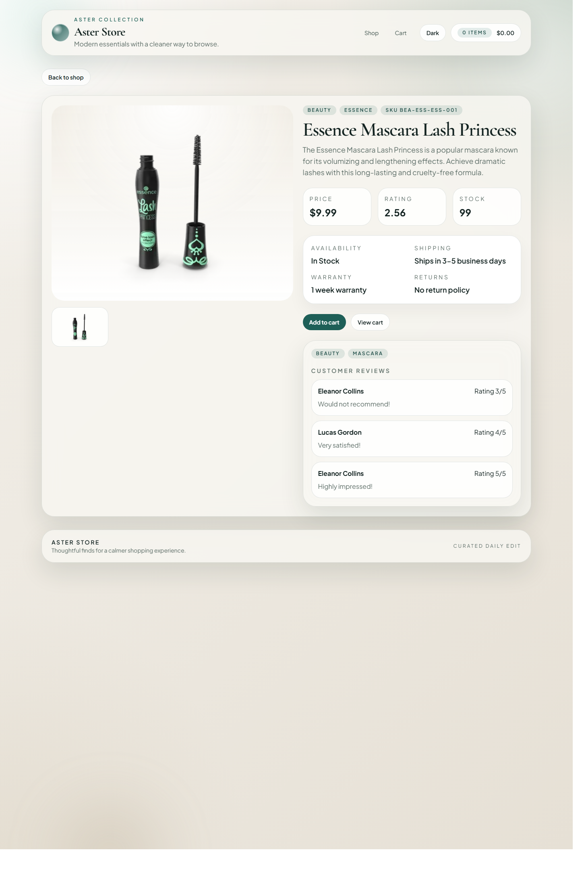
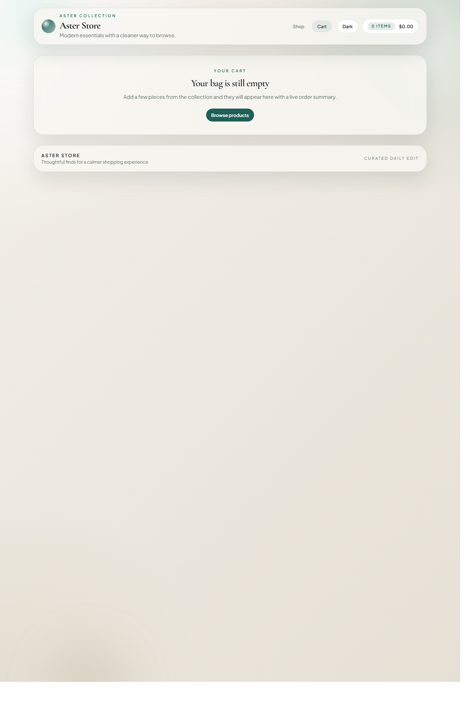

# Aster Store

A modern product store app built with React where users can browse products, view product details, filter by storefront categories, change layout/theme settings, and manage a shopping cart.

## Features

- Product list fetched from the DummyJSON API
- Product details page
- Search and sort products
- Storefront category filtering
- Dark mode / light mode
- Grid view / list view
- Shopping cart with add, remove, increase, decrease, clear, total items, and total price
- Responsive design
- Cart and settings saved in `localStorage`

## Tools / Libraries Used

- React
- Vite
- TailwindCSS 4
- React Router DOM
- Redux Toolkit
- React Redux
- TanStack React Query
- DummyJSON API

## Screenshots





## Steps to Run the Project

```bash
npm install
npm run dev
```
Live link: https://product-store-app-neon.vercel.app/
